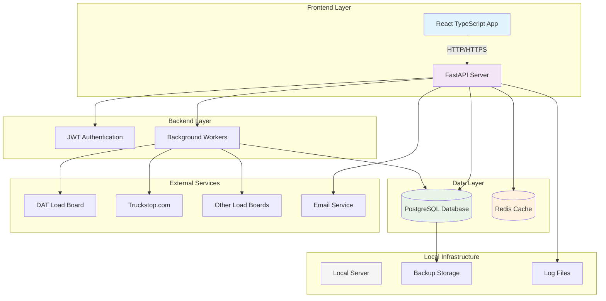
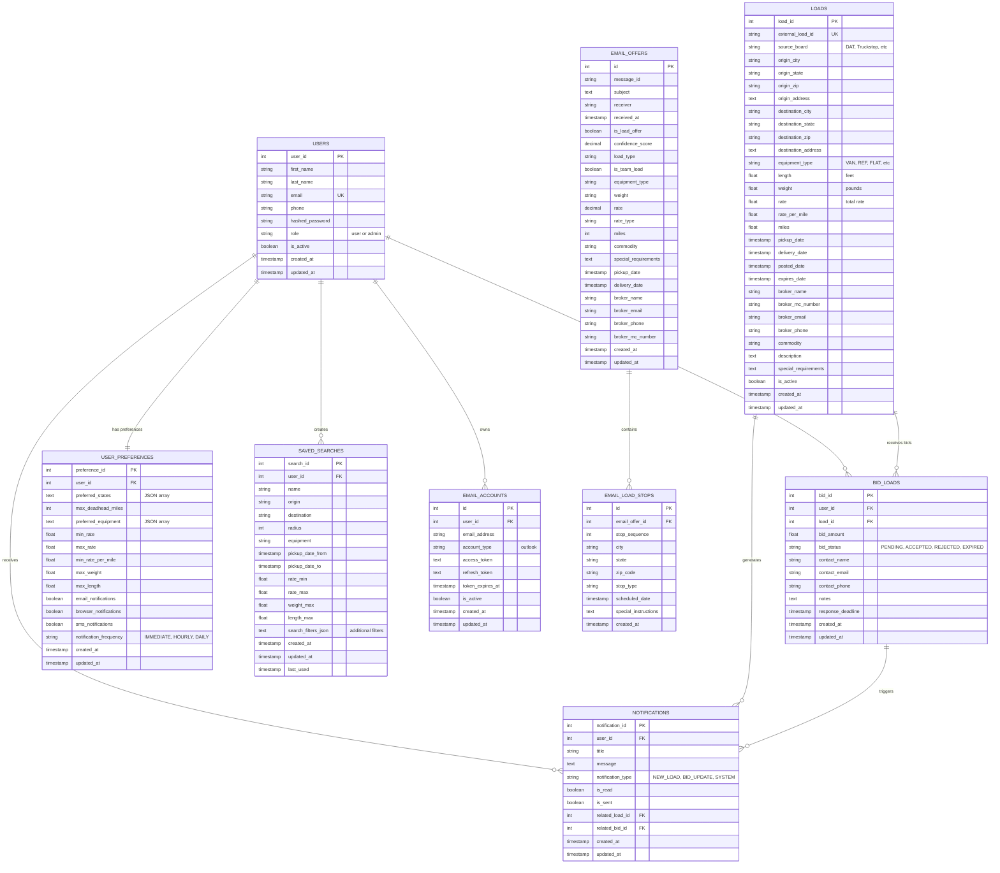

# PNX Load Board - Architecture Diagram

## System Architecture Overview

```mermaid
graph TB
    subgraph "Frontend Layer"
        UI[React TypeScript App]
        UI --> |HTTP/HTTPS| API
    end
    
    subgraph "Backend Layer"
        API[FastAPI Server]
        AUTH[JWT Authentication]
        WORKER[Background Workers]
        
        API --> AUTH
        API --> WORKER
    end
    
    subgraph "Data Layer"
        DB[(PostgreSQL Database)]
        CACHE[(Redis Cache)]
        
        API --> DB
        API --> CACHE
        WORKER --> DB
    end
    
    subgraph "External Services"
        LB1[DAT Load Board]
        LB2[Truckstop.com]        
        LB3[Other Load Boards]
        EMAIL[Email Service]
        
        WORKER --> LB1
        WORKER --> LB2
        WORKER --> LB3
        API --> EMAIL
    end
    
    subgraph "Local Infrastructure"
        SERVER[Local Server]
        BACKUP[Backup Storage]
        LOGS[Log Files]
        
        API --> LOGS
        DB --> BACKUP
    end
    
    style UI fill:#e1f5fe
    style API fill:#f3e5f5
    style DB fill:#e8f5e8
    style CACHE fill:#fff3e0
    style SERVER fill:#f5f5f5
```

## Database Schema (ERD)

```mermaid
erDiagram
    USERS {
        int user_id PK
        string first_name
        string last_name
        string email UK
        string phone
        string hashed_password
        string role "user or admin"
        boolean is_active
        timestamp created_at
        timestamp updated_at
    }
    
    LOADS {
        int load_id PK
        string external_load_id UK
        string source_board "DAT, Truckstop, etc"
        string origin_city
        string origin_state
        string origin_zip
        text origin_address
        string destination_city
        string destination_state
        string destination_zip
        text destination_address
        string equipment_type "VAN, REF, FLAT, etc"
        float length "feet"
        float weight "pounds"
        float rate "total rate"
        float rate_per_mile
        float miles
        timestamp pickup_date
        timestamp delivery_date
        timestamp posted_date
        timestamp expires_date
        string broker_name
        string broker_mc_number
        string broker_email
        string broker_phone
        string commodity
        text description
        text special_requirements
        boolean is_active
        timestamp created_at
        timestamp updated_at
    }
    
    BID_LOADS {
        int bid_id PK
        int user_id FK
        int load_id FK
        float bid_amount
        string bid_status "PENDING, ACCEPTED, REJECTED, EXPIRED"
        string contact_name
        string contact_email
        string contact_phone
        text notes
        timestamp response_deadline
        timestamp created_at
        timestamp updated_at
    }
    
    USER_PREFERENCES {
        int preference_id PK
        int user_id FK
        text preferred_states "JSON array"
        int max_deadhead_miles
        text preferred_equipment "JSON array"
        float min_rate
        float max_rate
        float min_rate_per_mile
        float max_weight
        float max_length
        boolean email_notifications
        boolean browser_notifications
        boolean sms_notifications
        string notification_frequency "IMMEDIATE, HOURLY, DAILY"
        timestamp created_at
        timestamp updated_at
    }
    
    NOTIFICATIONS {
        int notification_id PK
        int user_id FK
        string title
        text message
        string notification_type "NEW_LOAD, BID_UPDATE, SYSTEM"
        boolean is_read
        boolean is_sent
        int related_load_id FK
        int related_bid_id FK
        timestamp created_at
        timestamp updated_at
    }
    
    SAVED_SEARCHES {
        int search_id PK
        int user_id FK
        string name
        string origin
        string destination
        int radius
        string equipment
        timestamp pickup_date_from
        timestamp pickup_date_to
        float rate_min
        float rate_max
        float weight_max
        float length_max
        text search_filters_json "additional filters"
        timestamp created_at
        timestamp updated_at
        timestamp last_used
    }
    
    EMAIL_ACCOUNTS {
        int id PK
        int user_id FK
        string email_address
        string account_type "outlook"
        text access_token
        text refresh_token
        timestamp token_expires_at
        boolean is_active
        timestamp created_at
        timestamp updated_at
    }
    
    EMAIL_OFFERS {
        int id PK
        string message_id
        text subject
        string receiver
        timestamp received_at
        boolean is_load_offer
        decimal confidence_score
        string load_type
        boolean is_team_load
        string equipment_type
        string weight
        decimal rate
        string rate_type
        int miles
        string commodity
        text special_requirements
        timestamp pickup_date
        timestamp delivery_date
        string broker_name
        string broker_email
        string broker_phone
        string broker_mc_number
        timestamp created_at
        timestamp updated_at
    }
    
    EMAIL_LOAD_STOPS {
        int id PK
        int email_offer_id FK
        int stop_sequence
        string city
        string state
        string zip_code
        string stop_type
        timestamp scheduled_date
        text special_instructions
        timestamp created_at
    }
    
    USERS ||--o{ BID_LOADS : "places bids"
    USERS ||--|| USER_PREFERENCES : "has preferences"
    USERS ||--o{ NOTIFICATIONS : "receives"
    USERS ||--o{ SAVED_SEARCHES : "creates"
    USERS ||--o{ EMAIL_ACCOUNTS : "owns"
    
    LOADS ||--o{ BID_LOADS : "receives bids"
    LOADS ||--o{ NOTIFICATIONS : "generates"
    
    BID_LOADS ||--o{ NOTIFICATIONS : "triggers"
    
    EMAIL_OFFERS ||--o{ EMAIL_LOAD_STOPS : "contains"
```